# nestjs
ReadMe for nest js

# Setup
```bash
$ npm i -g @nestjs/cli
$ nest new project-name
```

## Controllers
A controller's purpose is to receive specific requests for the application. The routing mechanism controls which controller receives which requests.
```bash
Hint
For quickly creating a CRUD controller with the validation built-in, you may use the CLI's CRUD generator: `nest g resource [name]`.
```

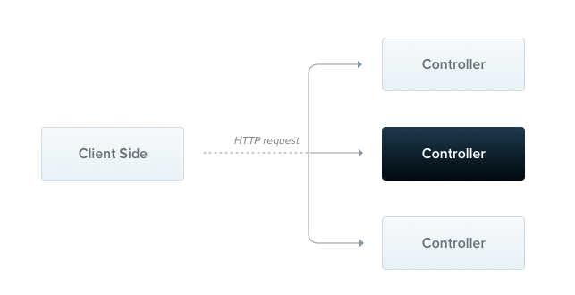

```js
import { Controller, Get } from '@nestjs/common';

@Controller('cats')
export class CatsController {
  @Get()
  findAll(): string {
    return 'This action returns all cats';
  }
}
```

The request object represents the HTTP request and has properties for the request query string, parameters, HTTP headers, and body (read more here). In most cases, it's not necessary to grab these properties manually. We can use dedicated decorators instead, such as @Body() or @Query(), which are available out of the box. Below is a list of the provided decorators and the plain platform-specific objects they represent.

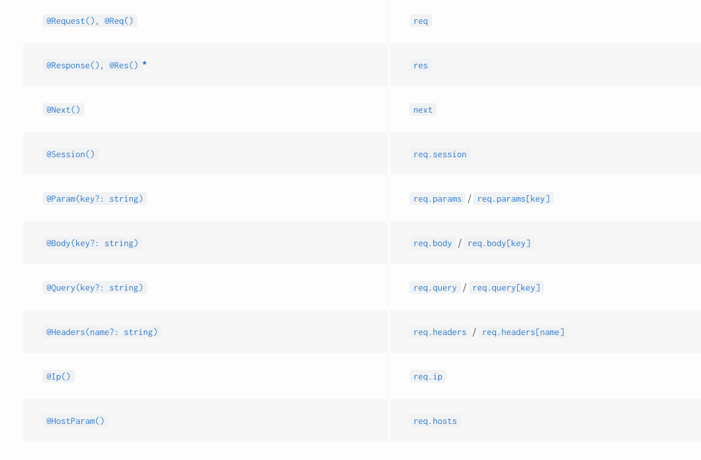

```bash
Hint
To create a controller using the CLI, simply execute the $ `nest g controller [name]` command.
```

`It's that simple. Nest provides decorators for all of the standard HTTP methods: @Get(), @Post(), @Put(), @Delete(), @Patch(), @Options(), and @Head(). In addition, @All() defines an endpoint that handles all of them.`

### Route wildcards

Pattern based routes are supported as well. For instance, the asterisk is used as a wildcard, and will match any combination of characters.
```js
@Get('ab*cd')
findAll() {
  return 'This route uses a wildcard';
}
```

### Status code
As mentioned, the response status code is always 200 by default, except for POST requests which are 201. We can easily change this behavior by adding the @HttpCode(...) decorator at a handler level.

```js
@Post()
@HttpCode(204)
create() {
  return 'This action adds a new cat';
}
```

### Headers
To specify a custom response header, you can either use a @Header() decorator or a library-specific response object (and call res.header() directly).

```js
@Post()
@Header('Cache-Control', 'no-store')
create() {
  return 'This action adds a new cat';
}
```

### Redirection
To redirect a response to a specific URL, you can either use a @Redirect() decorator or a library-specific response object (and call res.redirect() directly).

@Redirect() takes two arguments, url and statusCode, both are optional. The default value of statusCode is 302 (Found) if omitted.

```js
@Get('docs')
@Redirect('https://docs.nestjs.com', 302)
getDocs(@Query('version') version) {
  if (version && version === '5') {
    return { url: 'https://docs.nestjs.com/v5/' };
  }
}
```

### Route parameters

```js
@Get(':id')
findOne(@Param() params: any): string {
  console.log(params.id);
  return `This action returns a #${params.id} cat`;
}


@Get(':id')
findOne(@Param('id') id: string): string {
  return `This action returns a #${id} cat`;
}

```

### Sub-Domain Routing

```js
@Controller({ host: 'admin.example.com' })
export class AdminController {
  @Get()
  index(): string {
    return 'Admin page';
  }
}

@Controller({ host: ':account.example.com' })
export class AccountController {
  @Get()
  getInfo(@HostParam('account') account: string) {
    return account;
  }
}
```

### Asynchronicity
```js
@Get()
async findAll(): Promise<any[]> {
  return [];
}


@Get()
findAll(): Observable<any[]> {
  return of([]);
}

```

### Request payloads
```js
// create-cat.dto.ts
export class CreateCatDto {
  name: string;
  age: number;
  breed: string;
}

// cats.controller.ts
@Post()
async create(@Body() createCatDto: CreateCatDto) {
  return 'This action adds a new cat';
}

```
### example
```js

import { Controller, Get, Query, Post, Body, Put, Param, Delete } from '@nestjs/common';
import { CreateCatDto, UpdateCatDto, ListAllEntities } from './dto';

@Controller('cats')
export class CatsController {
  @Post()
  create(@Body() createCatDto: CreateCatDto) {
    return 'This action adds a new cat';
  }

  @Get()
  findAll(@Query() query: ListAllEntities) {
    return `This action returns all cats (limit: ${query.limit} items)`;
  }

  @Get(':id')
  findOne(@Param('id') id: string) {
    return `This action returns a #${id} cat`;
  }

  @Put(':id')
  update(@Param('id') id: string, @Body() updateCatDto: UpdateCatDto) {
    return `This action updates a #${id} cat`;
  }

  @Delete(':id')
  remove(@Param('id') id: string) {
    return `This action removes a #${id} cat`;
  }
}

```
----------------------------------------------------------------------------------------------------

## providers
Providers are a fundamental concept in Nest. Many of the basic Nest classes may be treated as a provider – services, repositories, factories, helpers, and so on. The main idea of a provider is that it can be injected as a dependency; this means objects can create various relationships with each other, and the function of "wiring up" these objects can largely be delegated to the Nest runtime system.

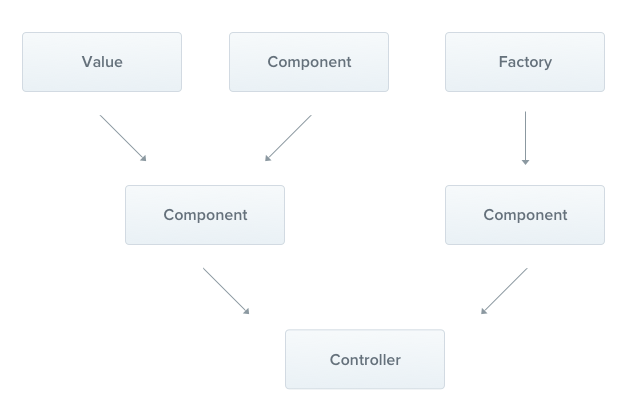

In the previous chapter, we built a simple CatsController. Controllers should handle HTTP requests and delegate more complex tasks to providers. Providers are plain JavaScript classes that are declared as providers in a NestJS module. For more information

### Services

```js
// cats.service.ts
import { Injectable } from '@nestjs/common';
import { Cat } from './interfaces/cat.interface';

@Injectable()
export class CatsService {
  private readonly cats: Cat[] = [];

  create(cat: Cat) {
    this.cats.push(cat);
  }

  findAll(): Cat[] {
    return this.cats;
  }
}
```

```bash
Hint
To create a service using the CLI, simply execute the $ `nest g service cats` command.
```

```js
// interfaces/cat.interface.ts
export interface Cat {
  name: string;
  age: number;
  breed: string;
}

// cats.controller.ts
import { Controller, Get, Post, Body } from '@nestjs/common';
import { CreateCatDto } from './dto/create-cat.dto';
import { CatsService } from './cats.service';
import { Cat } from './interfaces/cat.interface';

@Controller('cats')
export class CatsController {
  constructor(private catsService: CatsService) {}

  @Post()
  async create(@Body() createCatDto: CreateCatDto) {
    this.catsService.create(createCatDto);
  }

  @Get()
  async findAll(): Promise<Cat[]> {
    return this.catsService.findAll();
  }
}

```

### Dependency injection
Nest is built around the strong design pattern commonly known as Dependency injection.

### Scopes
Providers normally have a lifetime ("scope") synchronized with the application lifecycle. When the application is bootstrapped, every dependency must be resolved, and therefore every provider has to be instantiated. Similarly, when the application shuts down, each provider will be destroyed. However, there are ways to make your provider lifetime request-scoped as well. You can read more about these techniques in the Injection Scopes chapter.

### Custom providers
There are several ways to define a provider: you can use plain values, classes, and either asynchronous or synchronous factories.
### Optional providers
Occasionally, you might have dependencies which do not necessarily have to be resolved. For instance, your class may depend on a configuration object, but if none is passed, the default values should be used. In such a case, the dependency becomes optional, because lack of the configuration provider wouldn't lead to errors.

To indicate a provider is optional, use the @Optional() decorator in the constructor's signature.
```js
import { Injectable, Optional, Inject } from '@nestjs/common';

@Injectable()
export class HttpService<T> {
  constructor(@Optional() @Inject('HTTP_OPTIONS') private httpClient: T) {}
}
```

### Property-based injection
The technique we've used so far is called constructor-based injection, as providers are injected via the constructor method. In some very specific cases, property-based injection might be useful. For instance, if your top-level class depends on either one or multiple providers, passing them all the way up by calling super() in sub-classes from the constructor can be very tedious. In order to avoid this, you can use the @Inject() decorator at the property level.
```js

import { Injectable, Inject } from '@nestjs/common';

@Injectable()
export class HttpService<T> {
  @Inject('HTTP_OPTIONS')
  private readonly httpClient: T;
}
```

### Provider registration
Now that we have defined a provider (CatsService), and we have a consumer of that service (CatsController), we need to register the service with Nest so that it can perform the injection.
```js
import { Module } from '@nestjs/common';
import { CatsController } from './cats/cats.controller';
import { CatsService } from './cats/cats.service';

@Module({
  controllers: [CatsController],
  providers: [CatsService],
})
export class AppModule {}
```
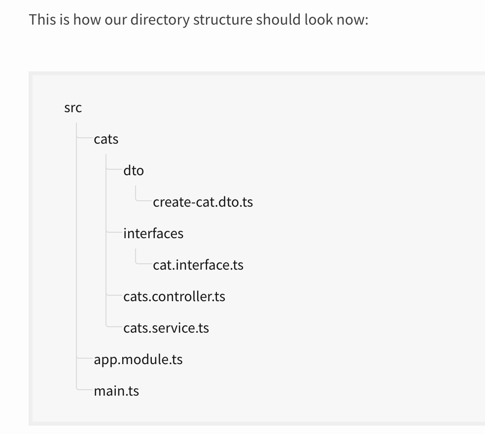

----------------------------------------------------------------------------------------------------
## Modules
A module is a class annotated with a @Module() decorator. The @Module() decorator provides metadata that Nest makes use of to organize the application structure.
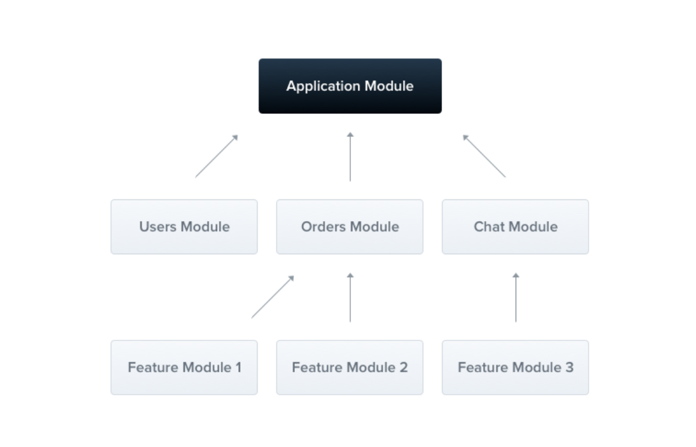
Each application has at least one module, a root module. The root module is the starting point Nest uses to build the application graph - the internal data structure Nest uses to resolve module and provider relationships and dependencies. 
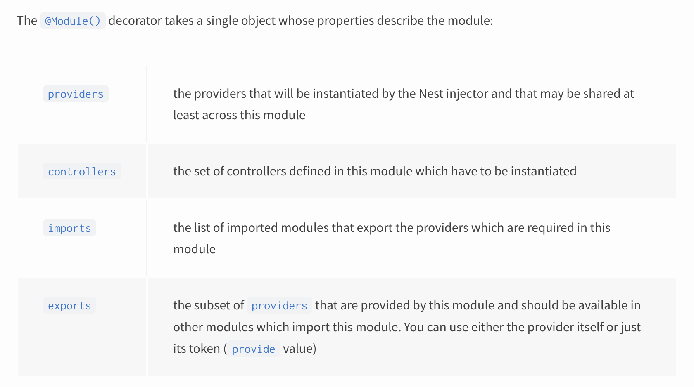

```js
import { Module } from '@nestjs/common';
import { CatsController } from './cats.controller';
import { CatsService } from './cats.service';

@Module({
  controllers: [CatsController],
  providers: [CatsService],
})
export class CatsModule {}
```

```bash
Hint
To create a module using the CLI, simply execute the $ nest g module cats command.
```
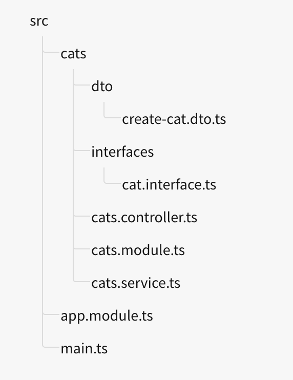

### Shared modules
In Nest, modules are singletons by default, and thus you can share the same instance of any provider between multiple modules effortlessly.
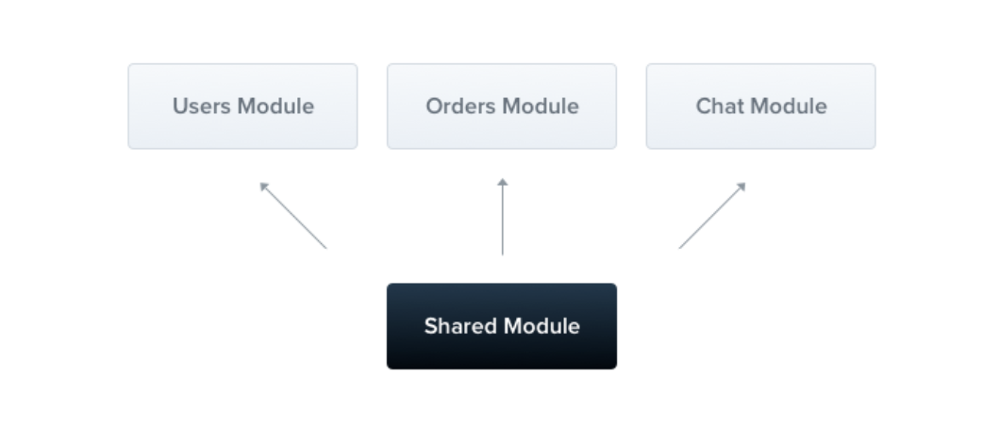

### Module re-exporting
As seen above, Modules can export their internal providers. In addition, they can re-export modules that they import. In the example below, the CommonModule is both imported into and exported from the CoreModule, making it available for other modules which import this one.
```js

@Module({
  imports: [CommonModule],
  exports: [CommonModule],
})
export class CoreModule {}

```
### Dependency injection#
A module class can inject providers as well (e.g., for configuration purposes):
```js

import { Module } from '@nestjs/common';
import { CatsController } from './cats.controller';
import { CatsService } from './cats.service';

@Module({
  controllers: [CatsController],
  providers: [CatsService],
})
export class CatsModule {
  constructor(private catsService: CatsService) {}
}

```
### Global modules
When you want to provide a set of providers which should be available everywhere out-of-the-box (e.g., helpers, database connections, etc.), make the module global with the @Global() decorator.
```js
import { Module, Global } from '@nestjs/common';
import { CatsController } from './cats.controller';
import { CatsService } from './cats.service';

@Global()
@Module({
  controllers: [CatsController],
  providers: [CatsService],
  exports: [CatsService],
})
export class CatsModule {}
```

`Making everything global is not a good design decision. Global modules are available to reduce the amount of necessary boilerplate. The imports array is generally the preferred way to make the module's API available to consumers.`

### Dynamic modules

```js

import { Module, DynamicModule } from '@nestjs/common';
import { createDatabaseProviders } from './database.providers';
import { Connection } from './connection.provider';

@Module({
  providers: [Connection],
  exports: [Connection],
})
export class DatabaseModule {
  static forRoot(entities = [], options?): DynamicModule {
    const providers = createDatabaseProviders(options, entities);
    return {
      module: DatabaseModule,
      providers: providers,
      exports: providers,
    };
  }
}

```
----------------------------------------------------------------------------------------------------
## Middleware
Middleware is a function which is called before the route handler. Middleware functions have access to the request and response objects, and the next() middleware function in the application’s request-response cycle. The next middleware function is commonly denoted by a variable named next.


```js
// logger.middleware.ts

import { Injectable, NestMiddleware } from '@nestjs/common';
import { Request, Response, NextFunction } from 'express';

@Injectable()
export class LoggerMiddleware implements NestMiddleware {
  use(req: Request, res: Response, next: NextFunction) {
    console.log('Request...');
    next();
  }
}

```

### Applying middleware
There is no place for middleware in the @Module() decorator. Instead, we set them up using the configure() method of the module class. Modules that include middleware have to implement the NestModule interface. Let's set up the LoggerMiddleware at the AppModule level.

```js
import { Module, NestModule, MiddlewareConsumer } from '@nestjs/common';
import { LoggerMiddleware } from './common/middleware/logger.middleware';
import { CatsModule } from './cats/cats.module';

@Module({
  imports: [CatsModule],
})
export class AppModule implements NestModule {
  configure(consumer: MiddlewareConsumer) {
    consumer
      .apply(LoggerMiddleware)
      .forRoutes('cats');
  }
}
```

### Middleware consumer
The MiddlewareConsumer is a helper class. It provides several built-in methods to manage middleware. All of them can be simply chained in the fluent style. The forRoutes() method can take a single string, multiple strings, a RouteInfo object, a controller class and even multiple controller classes. In most cases you'll probably just pass a list of controllers separated by commas. Below is an example with a single controller:
```js
import { Module, NestModule, MiddlewareConsumer } from '@nestjs/common';
import { LoggerMiddleware } from './common/middleware/logger.middleware';
import { CatsModule } from './cats/cats.module';
import { CatsController } from './cats/cats.controller';

@Module({
  imports: [CatsModule],
})
export class AppModule implements NestModule {
  configure(consumer: MiddlewareConsumer) {
    consumer
      .apply(LoggerMiddleware)
      .forRoutes(CatsController);
  }
}
```
### Functional middleware
```js
// logger.middleware.ts
import { Request, Response, NextFunction } from 'express';

export function logger(req: Request, res: Response, next: NextFunction) {
  console.log(`Request...`);
  next();
};


// apps.module.ts
consumer
  .apply(logger)
  .forRoutes(CatsController);

```
### Multiple middleware
```js
consumer.apply(cors(), helmet(), logger).forRoutes(CatsController);
```

### Global middleware
```js

const app = await NestFactory.create(AppModule);
app.use(logger);
await app.listen(process.env.PORT ?? 3000);
```
----------------------------------------------------------------------------------------------------
## Exception filters
Nest comes with a built-in exceptions layer which is responsible for processing all unhandled exceptions across an application. When an exception is not handled by your application code, it is caught by this layer, which then automatically sends an appropriate user-friendly response.
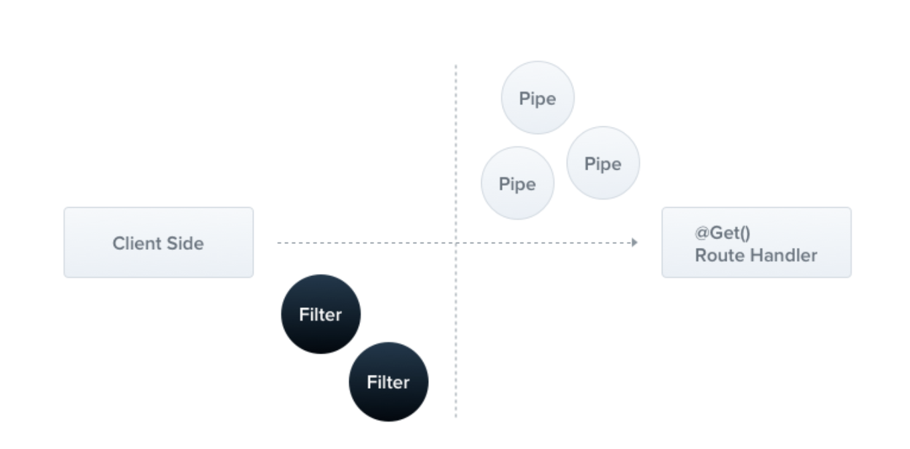

### Throwing standard exceptions
Nest provides a built-in HttpException class, exposed from the @nestjs/common package. For typical HTTP REST/GraphQL API based applications, it's best practice to send standard HTTP response objects when certain error conditions occur.

```js
@Get()
async findAll() {
  throw new HttpException('Forbidden', HttpStatus.FORBIDDEN);
}
```

### Custom exceptions
```js
export class ForbiddenException extends HttpException {
  constructor() {
    super('Forbidden', HttpStatus.FORBIDDEN);
  }
}


@Get()
async findAll() {
  throw new ForbiddenException();
}

```

### Built-in HTTP exceptions
Nest provides a set of standard exceptions that inherit from the base HttpException. These are exposed from the @nestjs/common package, and represent many of the most common HTTP exceptions:

- BadRequestException
- UnauthorizedException
- NotFoundException
- ForbiddenException
- NotAcceptableException
- RequestTimeoutException
- ConflictException
- GoneException
- HttpVersionNotSupportedException
- PayloadTooLargeException
- UnsupportedMediaTypeException
- UnprocessableEntityException
- InternalServerErrorException
- NotImplementedException
- ImATeapotException
- MethodNotAllowedException
- BadGatewayException
- ServiceUnavailableException
- GatewayTimeoutException
- PreconditionFailedException

### Exception filters
While the base (built-in) exception filter can automatically handle many cases for you, you may want full control over the exceptions layer. For example, you may want to add logging or use a different JSON schema based on some dynamic factors. Exception filters are designed for exactly this purpose. They let you control the exact flow of control and the content of the response sent back to the client.

```js

import { ExceptionFilter, Catch, ArgumentsHost, HttpException } from '@nestjs/common';
import { Request, Response } from 'express';

@Catch(HttpException)
export class HttpExceptionFilter implements ExceptionFilter {
  catch(exception: HttpException, host: ArgumentsHost) {
    const ctx = host.switchToHttp();
    const response = ctx.getResponse<Response>();
    const request = ctx.getRequest<Request>();
    const status = exception.getStatus();

    response
      .status(status)
      .json({
        statusCode: status,
        timestamp: new Date().toISOString(),
        path: request.url,
      });
  }
}
```
### Binding filters
```js
@Post()
@UseFilters(new HttpExceptionFilter())
async create(@Body() createCatDto: CreateCatDto) {
  throw new ForbiddenException();
}

// controller scoped
// cats.controller.ts

@UseFilters(new HttpExceptionFilter())
export class CatsController {}

// To create a global-scoped filter, you would do the following:

async function bootstrap() {
  const app = await NestFactory.create(AppModule);
  app.useGlobalFilters(new HttpExceptionFilter());
  await app.listen(process.env.PORT ?? 3000);
}
bootstrap();

```

### Catch everything
In order to catch every unhandled exception (regardless of the exception type), leave the @Catch() decorator's parameter list empty, e.g., @Catch().

```js

import {
  ExceptionFilter,
  Catch,
  ArgumentsHost,
  HttpException,
  HttpStatus,
} from '@nestjs/common';
import { HttpAdapterHost } from '@nestjs/core';

@Catch()
export class CatchEverythingFilter implements ExceptionFilter {
  constructor(private readonly httpAdapterHost: HttpAdapterHost) {}

  catch(exception: unknown, host: ArgumentsHost): void {
    // In certain situations `httpAdapter` might not be available in the
    // constructor method, thus we should resolve it here.
    const { httpAdapter } = this.httpAdapterHost;

    const ctx = host.switchToHttp();

    const httpStatus =
      exception instanceof HttpException
        ? exception.getStatus()
        : HttpStatus.INTERNAL_SERVER_ERROR;

    const responseBody = {
      statusCode: httpStatus,
      timestamp: new Date().toISOString(),
      path: httpAdapter.getRequestUrl(ctx.getRequest()),
    };

    httpAdapter.reply(ctx.getResponse(), responseBody, httpStatus);
  }
}
```
### Inheritance
```js

import { Catch, ArgumentsHost } from '@nestjs/common';
import { BaseExceptionFilter } from '@nestjs/core';

@Catch()
export class AllExceptionsFilter extends BaseExceptionFilter {
  catch(exception: unknown, host: ArgumentsHost) {
    super.catch(exception, host);
  }
}
```
----------------------------------------------------------------------------------------------------
## Pipes
A pipe is a class annotated with the @Injectable() decorator, which implements the PipeTransform interface.

**Pipes have two typical use cases:
- transformation: transform input data to the desired form (e.g., from string to integer)
- validation: evaluate input data and if valid, simply pass it through unchanged; otherwise, throw an exception

### Built-in pipes
- ValidationPipe
- ParseIntPipe
- ParseFloatPipe
- ParseBoolPipe
- ParseArrayPipe
- ParseUUIDPipe
- ParseEnumPipe
- DefaultValuePipe
- ParseFilePipe

### Binding pipes
```js
// ex1
@Get(':id')
async findOne(@Param('id', ParseIntPipe) id: number) {
  return this.catsService.findOne(id);
}

// error
{
  "statusCode": 400,
  "message": "Validation failed (numeric string is expected)",
  "error": "Bad Request"
}

// ex2
@Get(':id')
async findOne(
  @Param('id', new ParseIntPipe({ errorHttpStatusCode: HttpStatus.NOT_ACCEPTABLE }))
  id: number,
) {
  return this.catsService.findOne(id);
}


@Get()
async findOne(@Query('id', ParseIntPipe) id: number) {
  return this.catsService.findOne(id);
}

@Get(':uuid')
async findOne(@Param('uuid', new ParseUUIDPipe()) uuid: string) {
  return this.catsService.findOne(uuid);
}

```

### Custom pipes

```js
//validation.pipe.ts
import { PipeTransform, Injectable, ArgumentMetadata } from '@nestjs/common';

@Injectable()
export class ValidationPipe implements PipeTransform {
  transform(value: any, metadata: ArgumentMetadata) {
    return value;
  }
}
```
Every pipe must implement the transform() method to fulfill the PipeTransform interface contract. This method has two parameters:
- value
- metadata

The value parameter is the currently processed method argument (before it is received by the route handling method), and metadata is the currently processed method argument's metadata. The metadata object has these properties:

```js

export interface ArgumentMetadata {
  type: 'body' | 'query' | 'param' | 'custom';
  metatype?: Type<unknown>;
  data?: string;
}
```

`Read docs for more`

----------------------------------------------------------------------------------------------------
## Guards
A guard is a class annotated with the @Injectable() decorator, which implements the CanActivate interface.
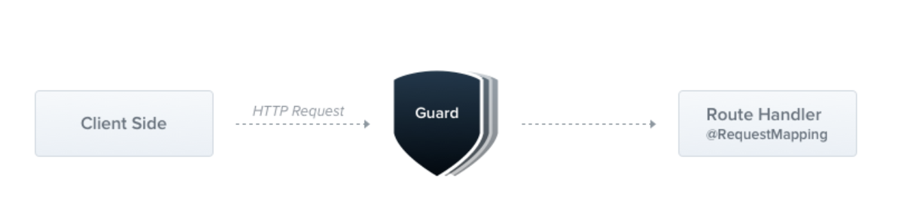

Guards have a single responsibility. They determine whether a given request will be handled by the route handler or not, depending on certain conditions (like permissions, roles, ACLs, etc.) present at run-time. This is often referred to as authorization. Authorization (and its cousin, authentication, with which it usually collaborates) has typically been handled by middleware in traditional Express applications. 

But middleware, by its nature, is dumb. It doesn't know which handler will be executed after calling the next() function. On the other hand, Guards have access to the ExecutionContext instance, and thus know exactly what's going to be executed next. They're designed, much like exception filters, pipes, and interceptors, to let you interpose processing logic at exactly the right point in the request/response cycle, and to do so declaratively. This helps keep your code DRY and declarative.

`Guards are executed after all middleware, but before any interceptor or pipe.`

## Authorization guard
As mentioned, authorization is a great use case for Guards because specific routes should be available only when the caller (usually a specific authenticated user) has sufficient permissions.

```js
// auth.guard.ts

import { Injectable, CanActivate, ExecutionContext } from '@nestjs/common';
import { Observable } from 'rxjs';

@Injectable()
export class AuthGuard implements CanActivate {
  canActivate(
    context: ExecutionContext,
  ): boolean | Promise<boolean> | Observable<boolean> {
    const request = context.switchToHttp().getRequest();
    return validateRequest(request);
  }
}
```
`Read docs for more`
----------------------------------------------------------------------------------------------------
## Interceptors

`Read docs for more`

----------------------------------------------------------------------------------------------------
## Custom route decorators

`Read docs for more`

----------------------------------------------------------------------------------------------------


----------------------------------------------------------------------------------------------------

# TECHNIQUES

## Configuration
```bash
$ npm i --save @nestjs/config
# The @nestjs/config package internally uses dotenv.
```
```js
# app.module.ts
import { Module } from '@nestjs/common';
import { ConfigModule } from '@nestjs/config';

@Module({
  imports: [ConfigModule.forRoot()],
})
export class AppModule {}
```

### Custom env file path
By default, the package looks for a .env file in the root directory of the application. To specify another path for the .env file, set the envFilePath property of an (optional) options object you pass to forRoot(), as follows:

```js
ConfigModule.forRoot({
  envFilePath: '.development.env',
});

// You can also specify multiple paths for .env files like this:
ConfigModule.forRoot({
  envFilePath: ['.env.development.local', '.env.development'],
});
```
### Custom configuration files
```js
// config/configuration.ts
export default () => ({
  port: parseInt(process.env.PORT, 10) || 3000,
  database: {
    host: process.env.DATABASE_HOST,
    port: parseInt(process.env.DATABASE_PORT, 10) || 5432
  }
});


import configuration from './config/configuration';
@Module({
  imports: [
    ConfigModule.forRoot({
      load: [configuration],
    }),
  ],
})
export class AppModule {}

```
### Using the ConfigService

### Cache environment variables

----------------------------------------------------------------------------------------------------
## Database
For convenience, Nest provides tight integration with TypeORM and Sequelize out-of-the-box with the @nestjs/typeorm and @nestjs/sequelize packages respectively, which we'll cover in the current chapter, and Mongoose with @nestjs/mongoose

### TypeORM Integration
For integrating with SQL and NoSQL databases, Nest provides the @nestjs/typeorm package. TypeORM is the most mature Object Relational Mapper (ORM) available for TypeScript. Since it's written in TypeScript, it integrates well with the Nest framework.

```bash
npm install --save @nestjs/typeorm typeorm mysql2
```

```js
// app.module.ts
import { Module } from '@nestjs/common';
import { TypeOrmModule } from '@nestjs/typeorm';

@Module({
  imports: [
    TypeOrmModule.forRoot({
      type: 'mysql',
      host: 'localhost',
      port: 3306,
      username: 'root',
      password: 'root',
      database: 'test',
      entities: [],
      synchronize: true,
    }),
  ],
})
export class AppModule {}
```
`Setting synchronize: true shouldn't be used in production - otherwise you can lose production data.`

Once this is done, the TypeORM DataSource and EntityManager objects will be available to inject across the entire project (without needing to import any modules), for example:
```js

import { DataSource } from 'typeorm';

@Module({
  imports: [TypeOrmModule.forRoot(), UsersModule],
})
export class AppModule {
  constructor(private dataSource: DataSource) {}
}
```
### Repository pattern
TypeORM supports the repository design pattern, so each entity has its own repository. These repositories can be obtained from the database data source.
```js
// user.entity.ts
import { Entity, Column, PrimaryGeneratedColumn } from 'typeorm';

@Entity()
export class User {
  @PrimaryGeneratedColumn()
  id: number;

  @Column()
  firstName: string;

  @Column()
  lastName: string;

  @Column({ default: true })
  isActive: boolean;
}
```

### Relations
Relations are associations established between two or more tables. Relations are based on common fields from each table, often involving primary and foreign keys.

There are three types of relations:
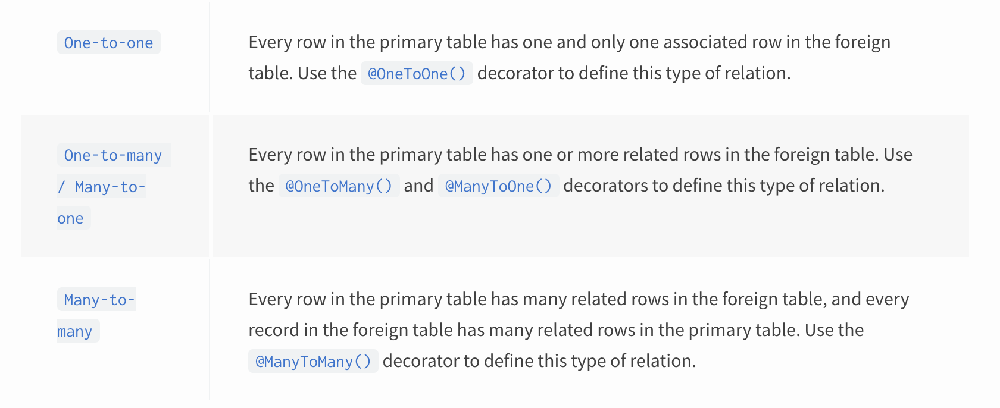


----------------------------------------------------------------------------------------------------

----------------------------------------------------------------------------------------------------
----------------------------------------------------------------------------------------------------
----------------------------------------------------------------------------------------------------
----------------------------------------------------------------------------------------------------
----------------------------------------------------------------------------------------------------
----------------------------------------------------------------------------------------------------
----------------------------------------------------------------------------------------------------
----------------------------------------------------------------------------------------------------
----------------------------------------------------------------------------------------------------
----------------------------------------------------------------------------------------------------
----------------------------------------------------------------------------------------------------

----------------------------------------------------------------------------------------------------
----------------------------------------------------------------------------------------------------
----------------------------------------------------------------------------------------------------

----------------------------------------------------------------------------------------------------
----------------------------------------------------------------------------------------------------
----------------------------------------------------------------------------------------------------
----------------------------------------------------------------------------------------------------
----------------------------------------------------------------------------------------------------
----------------------------------------------------------------------------------------------------
----------------------------------------------------------------------------------------------------
----------------------------------------------------------------------------------------------------
----------------------------------------------------------------------------------------------------
----------------------------------------------------------------------------------------------------
----------------------------------------------------------------------------------------------------
